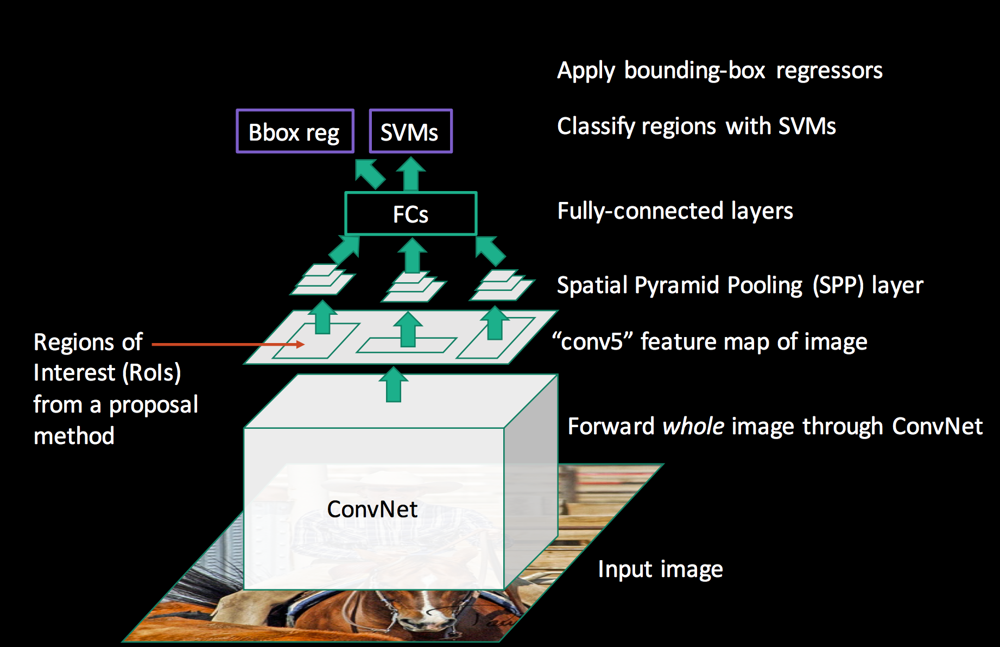

# Object Detection and Segmentation

### Introduction

1. Object detection is the task of finding the different objects in an image and classifying them.

1. **Region-CNN:**  The goal of R-CNN is to take in an image, and correctly identify where the main objects (via a bounding box) in the image.

    **Inputs:** Image 

    **Outputs:** Bounding boxes [4 corners co-ordinates] + labels for each object in the image.

1. Detection pipeline : Region Proposal generator $\rightarrow$ Feature extractor $\rightarrow$ Classification. 

### Prerequisites

#### Selective Search Method

This Algorithm looks at the image through windows of different sizes, and for each size tries to group together adjacent pixels by texture, color, or intensity to identify objects.

### R-CNN

 R-CNN is just the following steps:

1. The first module generates 2,000 region proposals using the Selective Search algorithm.
1. After being resized to a fixed pre-defined size, the second module extracts a feature vector of length 4,096 from each region proposal.
1. The third module uses a pre-trained SVM algorithm to classify the region proposal to either the background or one of the object classes.

After creating a set of region proposals, R-CNN passes the image through a modified version of AlexNet to determine whether or not it is a valid region

#### Drawbacks

1. It is a multi-stage model, where each stage is an independent component. Thus, it cannot be trained end-to-end.

1. It caches the extracted features from the pre-trained CNN on the disk to later train the SVMs. This requires hundreds of gigabytes of storage.

1. R-CNN depends on the Selective Search algorithm for generating region proposals, which takes a lot of time. Moreover, this algorithm cannot be customized to the detection problem.

1. Each region proposal is fed independently to the CNN for feature extraction. This makes it impossible to run R-CNN in real-time.

### Fast R-CNN

#### Insight 1: RoI (Region of Interest) Pooling

For the forward pass of the CNN, Girshick realized that for each image, a lot of proposed regions for the image invariably overlapped causing us to run the same CNN computation again and again (~2000 times!). His insight was simple — Why not run the CNN just once per image and then find a way to share that computation across the ~2000 proposals?

#### Contributions

1. Proposed a new layer called ROI Pooling that extracts equal-length feature vectors from all proposals (i.e. ROIs) in the same image.

1. Fast R-CNN does not cache the extracted features and thus does not need so much disk storage compared to R-CNN, which needs hundreds of gigabytes.

1. Training is single-stage, using a multi-task loss.

1. Fast R-CNN is more accurate than R-CNN

#### Drawback

Still generating those 2000 region proposals is done using selective search method which is in-efficient. This leads to the idea of developing Faster-RCNN which extracts the region proposals using CNNs(Region Proposal Network).  

### Faster-RCNN

Pipeline of Faster-RCNN

#### Contributions

1. Proposing region proposal network (RPN) which is a fully convolutional network that generates proposals with various scales and aspect ratios. The RPN implements the terminology of neural network with attention to tell the object detection (Fast R-CNN) where to look.
1. Rather than using pyramids of images (i.e. multiple instances of the image but at different scales) or pyramids of filters (i.e. multiple filters with different sizes), this paper introduced the concept of anchor boxes. An anchor box is a reference box of a specific scale and aspect ratio. With multiple reference anchor boxes, then multiple scales and aspect ratios exist for the single region. This can be thought of as a pyramid of reference anchor boxes. Each region is then mapped to each reference anchor box, and thus detecting objects at different scales and aspect ratios.
1. The convolutional computations are shared across the RPN and the Fast R-CNN. This reduces the computational time.

#### Pipeline

1. The RPN generates region proposals.
1. For all region proposals in the image, a fixed-length feature vector is extracted from each region using the ROI Pooling layer.
1. The extracted feature vectors are then classified using the Fast R-CNN.
1. The class scores of the detected objects in addition to their bounding-boxes are returned.