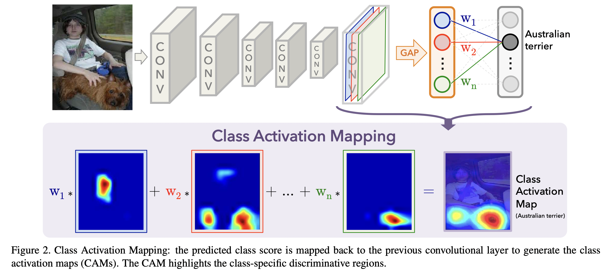

# Class Activation Maps (CAM)

1. [Youtube Video](https://www.youtube.com/watch?v=vTY58-51XZA)

1. [Github](https://github.com/nickbiso/Keras-Class-Activation-Map)

1. A Class Activation map for a particular category indicates the discriminative region used by CNN to identify the category.

1. The Network mainly consists of a large number of convolutional layers and just before the final output layer, we perform Global Average Pooling. The features thus obtained are fed to a fully connected layer having with softmax activation which produces the desired output. We can identify the importance of the image regions by projecting back the weights of the output layer on the convolutional feature maps obtained from the last Convolution Layer. This technique is known as Class Activation Mapping.

1. The Global Average Pooling layer(GAP) is preferred over the Global MaxPooling Layer(GMP) because GAP layers help to identify the complete extent of the object as compared to GMP layer which identifies just one discriminative part. This is because in GAP we take an average across all the activation which helps to find all the discriminative regions while GMP layer just considers only the most discriminative one.

1. The weights of the final layer corresponding to that class are extracted. Also, the feature map from the last convolutional layer is extracted.

1. Finally, the dot product of the extracted weights from the final layer and the feature map is calculated to produce the class activation map. The class activation map is upsampled by using Bi-Linear Interpolation and superimposed on the input image to show the regions which the CNN model is looking at. 

    

1. Drawbacks : It requires feature maps to directly precede the softmax layers, so it is applicable to a particular kind of CNN architectures that perform global average pooling over convolutional maps immediately before prediction. (i.e conv feature maps $\rightarrow$ global average pooling $\rightarrow$ softmax layer).