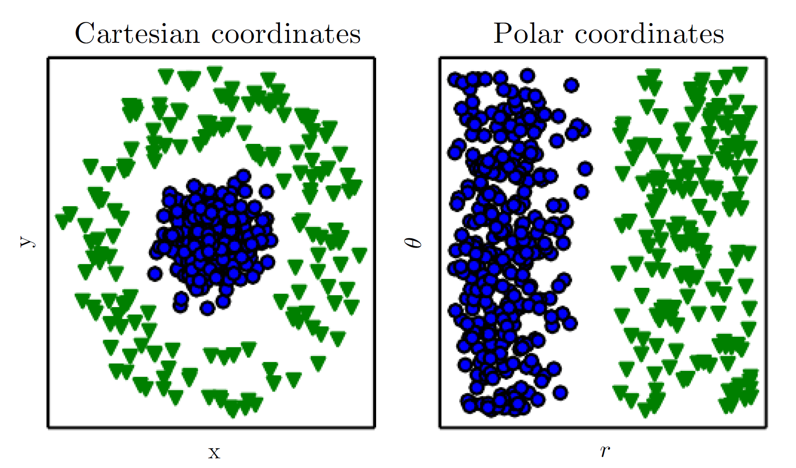

# Machine Learning 

# Introduction

## Artificial Intelligence 
Artificial intelligence (AI) is wide-ranging branch of computer science concerned with building smart machines capable of performing tasks that typically require human intelligence.

## Machine Learning 

1. AI systems need the ability to acquire their own knowledge, by extracting patterns from raw data. This capability is known as machine learning.

1.  What a typical “learning machine” does, is finding a mathematical formula, which, when applied to a collection of inputs (called “training data”), produces the desired outputs.

1.  Machine learning can also be defined as the process of solving a practical problem by 

    1.  Gathering a dataset

    1.  Algorithmically building a statistical model based on that dataset.
    
## Representation Learning 

1. The performance of these simple machine learning algorithms depends heavily on the representation of the data they are given.

1. Many artificial intelligence tasks can be solved by designing the right set of features to extract for that task, then providing these features to a simple machine
learning algorithm.

1. It is difficult to know what features should be extracted. Therefore, it is important to use machine learning to discover not only the mapping from representation to output but also the representation itself. This approach is known as representation learning.

1. The typical example of a representation learning algorithm is the autoencoder.

    1. An autoencoder is the combination of an encoder function that converts the input data into a different representation, and a decoder function that converts the new representation back into the original format. Different kinds of autoencoders aim to achieve different kinds of properties.

In the image below, the plot on the left, we represent some data using Cartesian coordinates, and the task is impossible. In the plot on the right, we represent the data with polar coordinates and the task becomes simple to solve with a vertical line

## Deep Learning

1.   Deep learning is a particular
kind of machine learning that achieves great power and flexibility by learning to represent the world as a nested hierarchy of concepts, with each concept defined in relation to simpler concepts, and more abstract representations computed in terms of less abstract ones.
1.  Historical aspects of Deep Learning

    1.  Deep learning known as cybernetics in the 1940s–1960s and known as connectionism in the 1980s–1990s, and deep learning beginning in 2006.
    1.  The neural perspective on deep learning is motivated by two main ideas. One idea is that the brain provides a proof by example that intelligent behavior is possible, and a conceptually straightforward path to building intelligence is to reverse engineer the computational principles behind the brain and duplicate its functionality. Another perspective is that it would be deeply interesting to understand the brain and the principles that underlie human intelligence
    1.  The Neocognitron introduced a powerful model architecture for processing images that was inspired
    by the structure of the mammalian visual system and later became the basis for the modern convolutional network.
    1.  Modern deep learning draws inspiration from many fields, especially applied math fundamentals like linear algebra, probability, information theory, and numerical optimization.
    1.  The field of DL is primarily concerned with how to build computer systems that are able to successfully solve tasks requiring intelligence, while the field of computational neuroscience is primarily concerned with building more accurate models of how the brain actually works.
    1.  Connectionism arose in the context of cognitive science. Cognitive science is an interdisciplinary approach to understanding the mind, combining multiple different levels of analysis.
    1.  The central idea in connectionism is that a large number of simple computational units can achieve intelligent behavior when networked together. This insight applies equally to neurons in biological nervous systems and to hidden units in computational models.
    1.  One of these concepts is that of distributed representation. This is the idea that each input to a system should be represented by many features, and each feature should be involved in the representation of many
    possible inputs.
    1.  During the 1990s, researchers made important advances in modeling sequences with neural networks,the long short-term memory or LSTM network  had introduced to resolve the fundamental mathematical difficulties in modeling long sequences.

1.  Why DL has started booming recently :

    1. Increasing dataset sizes.
    1. We have the computational resources to run much larger models today.
    1. Technical advancements which led to faster convergence of Neural Networks.

## Reinforcement Learning

1. Reinforcement learning is a subfield of machine learning where an agent must learn to perform a task by trial and error, without any guidance from the human operator.
The machine can execute actions in every state.
1. The machine can execute actions in every state. Different actions bring different rewards and could also move the machine to another state of the environment. The goal of a reinforcement learning algorithm is to learn a policy.
1. A policy is a function f (similar to the model in supervised learning) that takes the feature vector of a state as input and
outputs an optimal action to execute in that state. The action is optimal if it maximizes the expected average reward.

