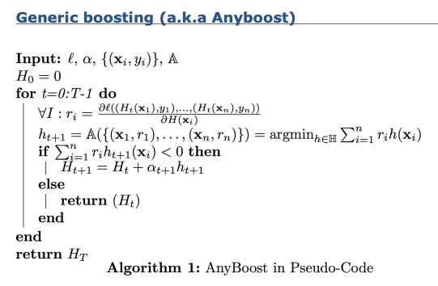
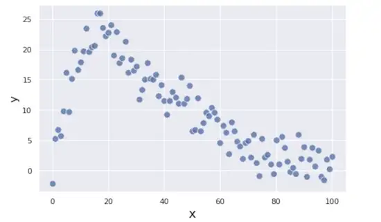

# Boosting
[Cornell Notes](https://www.cs.cornell.edu/courses/cs4780/2018fa/lectures/lecturenote19.html)
## Intuition

Just as humans learn from their mistakes and try not to repeat them further in life, the Boosting algorithm tries to build a strong learner (predictive model) from the mistakes of several weaker models (Weak learner : Classifier better than random guess i.e. may be coin tossing). You start by creating a model from the training data. Then, you create a second model from the previous one by trying to reduce the errors from the previous model. Models are added sequentially, each correcting its predecessor, until the training data is predicted perfectly or the maximum number of models have been added.

Boosting basically tries to reduce the bias error which arises when models are not able to identify relevant trends in the data. This happens by evaluating the difference between the predicted value and the actual value. 

## Types of Boosting Algorithms

1.  AdaBoost (Adaptive Boosting)
1.  Gradient Tree Boosting

## Maths behind Boosting (Gradient descent in functional space)

Create ensemble classifier $H_T(x) = \sum_{t=1}^T \alpha_t h_t(x)$. This ensemble classifier is built in an iterative fashion. In iteration $t$, we add the classifier $\alpha_t h_t(x)$ to the ensemble. At test time we evaluate all classifier and return the weighted sum. 

The process of constructing such an ensemble in a stage-wise fashion is very similar to gradient descent. However, instead of updating the model parameters in each iteration, we add functions to our ensemble. 
Let $l$ denote a (convex and differentiable) loss function. With a little abuse of notation we write
$$l(H)=\frac{1}{n}\sum_{t=1}^n l(H(x_i),y_i)$$

Assume we have already finished $t$ iterations and already have an ensemble classifier $H_t(x))$. Now in iteration $t+1$
we want to add one more weak learner $h_{t+1}$ to the ensemble. To this end we search for the weak learner that minimizes the loss the most,
$h_{t+1}=argmin_{h\in H}l(H_t + \alpha h_t)$
Once $h_{t+1}$ has been found, we add it to our ensemble, i.e. $$H_{t+1} := H_t + \alpha h$$

How can we find such $h\in H$ ?

Answer: Use gradient descent in function space. Given $H$, we want to find the step-size $\alpha$ and (weak learner) $h$ to minimize the loss $l(H+\alpha h)$. Use Taylor Approximation on $l(H+\alpha h)$

$$l(H +\alpha h) \approx l(H)+ \alpha <\nabla l(H), h>.$$

This approximation (of $l$ as a linear function) only holds within a small region around $l(H)$. As long as $\alpha$ is small. We therefore fix it to a small constant (e.g.
$\alpha\approx 0.1$). With the step-size $\alpha$ fixed, we can use the approximation above to find an almost optimal $h$:
Check the pseduo code 

## My comments

Generally, in case of gradient descent, we move in the opposite direction of gradient $\partial L / \partial H(\theta)$. Similarly, here we are training a extra model classifier whose predictions point the direction opposite to the gradient ($\partial l(H) / \partial H_t$), so that, the loss decreases and Overall predictions get closer the original (ground truth) values.  

# Gradient Boosted Regression Tree(GBRT)
In order to use regression trees for gradient boosting, we must be able to find a tree $h$ that maximizes $h=argmin_{h\in H} \sum^n_{i=1} r_i.h(x_i)$ where $r_i=\frac{\partial l}{\partial H(x_i)}$.

If the loss function $l$ is the squared loss, i.e. $$l(H)=\frac{1}{2}\sum^n_{i=1}(H(x_i) - y_i)^2$$
, then it is easy to show that $$t_i= -\partial l / \partial H(x_i)=y_i - H(x_i)$$
which is simply the residual, i.e. $r$ is the vector pointing from $y$ to $H$. However, it is important that you can use any other differentiable and convex loss function $l$ and the solution for your next weak learner $h$ will always be the regression tree minimizing the squared loss.

## My comments
In case of regression task and mean squared error loss, $\frac{\nabla l(H)}{\nabla H_t} = H_t(x_i) - y_i$. We are training a regressor which minimizes the product $(H_t(x_i) - y_i).h$. Hence, we are finding the direction of $H_t(x_i) - y_i$ and moving opposite to it (closer to $y_i$) which is what we want. 

## Example 
[Medium Article](https://towardsdatascience.com/all-you-need-to-know-about-gradient-boosting-algorithm-part-1-regression-2520a34a502)

Suppose we are trying to train a
 GBRT model to fit the particular data. 

Initially, we try to train a model which predicts the mean of the data for every $x$. As it is weak learner, we add more and more weak learners to predict the $y$ accurately. In the below image, we can find the predictions of the model as we keep adding more weak learners or decision stumps. 

# Gradient Boosting for classification

[Paperspace Blog](https://blog.paperspace.com/gradient-boosting-for-classification/)

# AdaBoost

1. [Cornell Notes](https://www.cs.cornell.edu/courses/cs4780/2018fa/lectures/lecturenote19.html)

1. [Stats Quest Video](https://www.youtube.com/watch?v=LsK-xG1cLYA&t=1023s) -- Watch this video before reading the notes below

1. [Toronto Handout Notes](https://www.cs.toronto.edu/~mbrubake/teaching/C11/Handouts/AdaBoost.pdf)

## Introduction

Two main ideas : 

1. More weight is assigned to the incorrectly classified samples so that they're classified correctly in the next decision stump. 

1. Weight is also assigned to each classifier based on the accuracy of the classifier, which means high accuracy = high weight!

Problem

1.  Classification : $y_i \in \{+1,-1\}$
1.  Weak learners: $h \in H$ are binary, $h(x_i)\in \{-1,+1\}$, $\forall x$.
1.  Step-size : We perform line-search to obtain best step-size $\alpha$. This determines how much weightage has to be given to that particular stump. 

1.  Loss function: Exponential loss  $l(H)=\sum^n_{i=1}e^{-y_i H(x_i)}$.
1. N : Total number of samples

## Steps 

