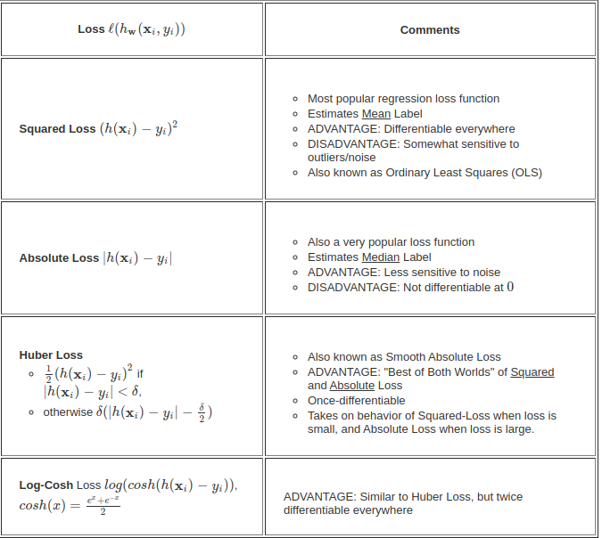
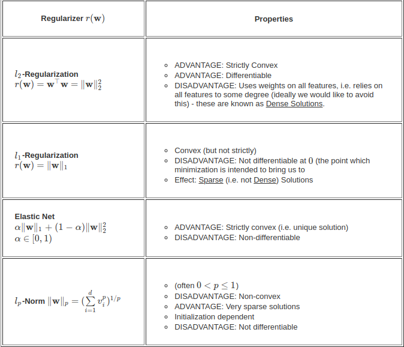

# Empirical Risk Minimization

[Source](https://www.cs.cornell.edu/courses/cs4780/2018sp/lectures/lecturenote10.html)

1. Remember the Unconstrained SVM Formulation $$\min_{\mathbf{w}}\ C\underset{Hinge-Loss}{\underbrace{\sum_{i=1}^{m}max[1-y_{i}\underset{h({\mathbf{x}_i})}{\underbrace{(w^{\top}{\mathbf{x}_i}+b)}},0]}}+\underset{l_{2}-Regularizer}{\underbrace{\left\Vert w\right\Vert _{z}^{2}}}$$

1. The hinge loss is the SVM's loss/error function of choice, whereas the $\left.l_{2}\right.$-regularizer reflects the complexity of the solution, and penalizes complex solutions. Unfortunately, it is not always possible or practical to minimize the true error, since it is often not continuous and/or differentiable. 

1. However, for most Machine Learning algorithms, it is possible to minimize a "Surrogate" Loss Function, which can generally be characterized as follows: $$ \min_{\mathbf{w}}\frac{1}{m}\sum_{i=1}^{m}\underset{Loss}{\underbrace{l_{(s)}(h_{\mathbf{w}}({\mathbf{x}_i}),y_{i})}}+\underset{Regularizer}{\underbrace{\lambda r(w)}}$$
where the Loss Function is a continuous function which penalizes training error, and the Regularizer is a continuous function which penalizes classifier complexity. Here we define $\lambda$ as $\frac{1}{C}$.

1. The science behind finding an ideal loss function and regularizer is known as Empirical Risk Minimization or Structured Risk Minimization.

## Commonly Used Binary Classification Loss Functions

1. As hinge-loss decreases, so does training error.
1. As $\left.z\rightarrow-\infty\right.$, the log-loss and the hinge loss become increasingly parallel.
1. The exponential loss and the hinge loss are both upper bounds of the zero-one loss. 
1. Zero-one loss is zero when the prediction is correct, and one when incorrect.

Loss Functions With Classification $y \in \{-1,+1\}$.

Plots of Common Classification Loss Functions - x-axis: $\left.h(\mathbf{x}_{i})y_{i}\right.$, or "correctness" of prediction; y-axis: loss value

## Commonly Used Regression Loss Functions

Loss Functions With Regression, i.e. $y\in\mathbb{R}$

Plots of Common Regression Loss Functions - x-axis: $\left.h(\mathbf{x}_{i})y_{i}\right.$, or "error" of prediction; y-axis: loss value

## Regularizers

$$ \min_{\mathbf{w},b} \sum_{i=1}^n\ell(\mathbf{w}^\top \vec x_i+b,y_i)+\lambda r(\mathbf{w}) \Leftrightarrow \min_{\mathbf{w},b} \sum_{i=1}^n\ell(\mathbf{w}^\top \vec x_i+b,y_i) \textrm { subject to: } r(w)\leq B$$

 In previous sections, $\left.l_{2}\right.$-regularizer has been introduced as the component in SVM that reflects the complexity of solutions. Besides the $\left.l_{2}\right.$-regularizer, other types of useful regularizers and their properties are listed below.

Loss Functions With Regression, i.e. $y\in\mathbb{R}$

# Bias and Variance Tradeoff

## Variance

Captures how much your classifier changes if you train on a different training set. How "over-specialized" is your classifier to a particular training set (overfitting)? If we have the best possible model for our training data, how far off are we from the average classifier?

## Bias

What is the inherent error that you obtain from your classifier even with infinite training data? This is due to your classifier being "biased" to a particular kind of solution (e.g. linear classifier). In other words, bias is inherent to your model.

## Noise

How big is the data-intrinsic noise? This error measures ambiguity due to your data distribution and feature representation. You can never beat this, it is an aspect of the data.

## Decomposition of Test error

The error between the classifier predicted values and the given labels is represented as the sum of Bias, Variance and Intrinsic error present in the given data itself.  $$Test error = Variance + Noise + Bias$$

## High Variance

Symptoms:

1.  Training error is much lower than test error.
1.  Training error is lower than $\epsilon$.
1.  Test error is above $\epsilon$.

Remedies:

1.  Add more training data.
1.  Reduce model complexity -- complex models are prone to high variance.
1.  Bagging.
 
## High Bias

Symptoms: Training error is higher than $\epsilon$.

Remedies:

1.  Use more complex model (e.g. kernelize, use non-linear models).
1.  Add features.
1.  Boosting.

The link to the [Proof of Bias and Variance Tradeoff equation](https://www.cs.cornell.edu/courses/cs4780/2018fa/lectures/lecturenote12.html)