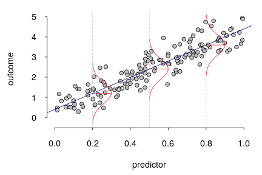

# Linear Regression
Source -> [Stanford notes](https://see.stanford.edu/materials/aimlcs229/cs229-notes1.pdf)

## Introduction

1.  In Linear Regression, We try to fit the data to a linear function. Let y as a linear function of x:
    $$h_{\theta}(x) = {\theta}_0 + {\theta}_1x_1 + {\theta}_2x_2$$
1.  Here the output is continuous value. $y \in \Re$
1.  To simplify our notation, we also introduce the convention of letting $x_0 = 1$ (this is the intercept term), so that
    $$ h(x) = {\Sigma_{i=0}}^m \theta_i x_i = \theta^T x$$
1.  Our objective is to make h(x) close to y, at least for
the training examples we have. Therefore, we try to minimize the loss function :
    $$J(\theta) = \frac{1}{2} {\sum_{i=0}}^m (h_\theta(x^i) - y^i)^2 $$

Note : We can go for the different loss function, that is absolute loss(MAE), power 4 etc. 
MAE is not differentiable at 0. Power4 or any other even power function penalizes the outliers very much and also those turns out to be non-convex function. 

## Minimization of Loss Function

1.  We want to choose $\theta$ so as to minimize $J(\theta)$.
1.  Let’s consider the gradient descent
algorithm, which starts with some initial θ, and repeatedly performs the update:
    $$ \theta_j := \theta_j - \alpha \frac{\partial J}{\partial \theta_j}$$
    where $\alpha$ is the learning rate.
1. This equation is derived from Taylor series. To understand the above equation in more depth, watch this Taylor series [3-Blue-1-Brown Video](https://www.youtube.com/watch?v=3d6DsjIBzJ4&t=295s)
1.  The linear regression algorithm that we saw earlier is known as a parametric learning algorithm, because it has a fixed, finite number of parameters (the $\theta_i$’s), which are fit to the data. Once we’ve fit the $\theta_i$’s and stored them away, we no longer need to
keep the training data around to make future predictions.

## Assumptions

1.  Linearity: The relationship between $X$ and the mean of $Y$ is linear.
1.  Independence: Observations are independent of each other.(Independent and Identical distribution $I.I.D$).
1.  Normality: For any fixed value of $X$, $Y$ is normally distributed.
1. Homoscedasticity: 
    * The variance of residual is the same for any value of $X$. In below figure, variance of $Y$ (actual value) at every $X$ value is same. 

    The blue regression lines connects the fitted y-values at each x-value and is assumed to be straight(*1^{st} assumption*). The red density curves visualise that the model assumes the y-data at each x-value to be normally distributed(*$3^{rd}$ assumption*) with the same variance (*$4^{th}$ assumption*) at different x-values.

    

## Normal method to minimize the loss (*Linear Regression Closed form Solution*)

1. X ~ $[]_{m\times n}$  and y ~ $[]_{m\times 1}$.
1. We have to minimize $$J = \frac{1}{2} (X\theta - y)^T (X\theta - y)$$
1. Therefore, $\nabla_\theta J = 0$. 
After differentating the J, we get $$\theta = {(X^TX)}^{-1}X^TY$$ 
(Refer to [stanford notes](https://see.stanford.edu/materials/aimlcs229/cs229-notes1.pdf) for proof in detail.)
1. Using the property $$ \nabla_{A^T} trABA^TC = B^TA^TC^T + BA^TC $$

## Probabilistic Interpretation

1. When faced with a regression problem, why might linear regression, and specifically why might the least-squares cost function J, be a reasonable choice?

1.  Let us assume that the target variables and the inputs are related via the equation $$y(i) = \theta^T x(i) + \epsilon(i)$$
where $\epsilon(i)$ is an error term.

1.  Assumptions :

    1.  $\epsilon(i)$ are distributed $I.I.D$ (Independently and Identically distributed).
    1.  $\epsilon(i) \approx N(0, \sigma^2)$ . This is same as $y_i\approx N(w^Tx_i, \sigma^2)$
    1.  $\sigma^2 = 1$ This doesn't effect the calculation

1.  Therefore, $$ p(\epsilon) =  \mathcal{N}(x; 0, 1) = \sqrt{\frac{1}{2 \pi}} exp(-\frac{1}{2}\epsilon^2)$$

This implies that , $$ p(y^i|x^i;\theta) = \sqrt{\frac{1}{2 \pi}} exp(-\frac{1}{2}(y^i - \theta^T x^i)^2)$$
Try to maximize the log likelihood. 

# Locally weighted Linear regression

## Why

Sometimes we cannot fit a straight line to the whole data. In those cases, if we consider only few datapoints near to the point we wanted to estimate, we may fit the line to those points in the neighborhood of that points. 

## How

1. To do so, we assign more weight to the points near to the test point and less weight to points far from it. 

1. Each time we want to predict $y$ for a test point $x'$, we need to fit the line to points near to $x'$. 

1. Assigning weights will be done using the formula : $$w(i) = exp[-\frac{(x(i) - x')^2}{\tau^2}]$$

1. Fit $\theta$ to minimize $$\sum_i w(i).[y(i) - \theta^T x(i)]^2$$

1. The bandwidth parameter $\tau$ controls how quickly the weight of a training example falls off with distance of its $x(i)$ from the query point $x$;

1. This is **non-parametric** learning algorithm (i,e) to
make predictions using locally weighted linear regression, we need to keep
the entire training set around.