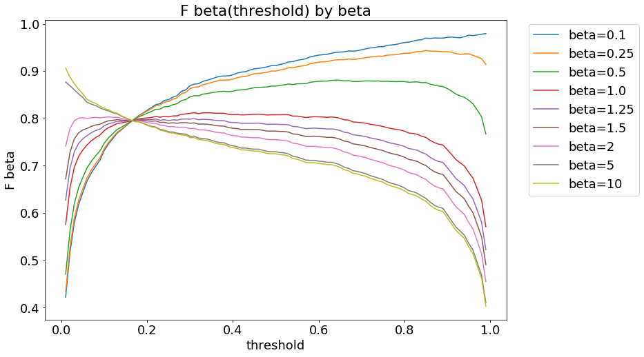

# Metrics
1. [Main Source](https://blog.exsilio.com/all/accuracy-precision-recall-f1-score-interpretation-of-performance-measures/)
2. [neptune.ai Blog](https://neptune.ai/blog/f1-score-accuracy-roc-auc-pr-auc)

## Prerequisite terminology 
1. True Positives $(TP)$ - These are the correctly predicted positive values which means that the value of actual class is $YES$ and the value of predicted class is also $YES$. 

1. True Negatives $(TN)$ - These are the correctly predicted negative values which means that the value of actual class is $NO$ and value of predicted class is also $NO$. 

False positives and false negatives, these values occur when your actual class contradicts with the predicted class.

1. False Positives $(FP)$ – When actual class is $NO$ and predicted class is $YES$. 

1. False Negatives $(FN)$ – When actual class is $YES$ but predicted class is $NO$. 

## Accuracy 

1. A ratio of correctly predicted observation to the total observations.
    $$\text{Accuracy} = \frac{TP+TN}{TP+FP+FN+TN}$$
1. When your problem is balanced using accuracy is usually a good start (i.e.) When every class/label is equally important to you, then accuracy is best metric to use.
1. Limitation - For example, in a particular sample of population, one out of a $1000$ people might have cancer. Thus, $999$ people don't have cancer. If we simply use a classifier, then that classifier predicts everyone as not having cancer, we can achieve an accuracy of $99.99\%$. But would we be willing to use this classifier for testing ourself? Definitely not. In such a case, accuracy is a bad metric. We instead use precision and recall to evaluate our classifier. 

## Precision and Recall

1. Precision is the ratio of correctly predicted positive observations to the total predicted positive observations. 
    $$Precision = \frac{\text{TP}}{\text{TP + FP}}$$
    The question that this metric answer is of all passengers that labeled as survived, how many actually survived? High precision relates to the low false positive rate.

1. Recall is the ratio of correctly predicted   positive observations to the all observations in actual positive class.
    $$Recall = \frac{\text{TP}}{\text{TP + FN}}$$
    Recall is also called as Sensitivity or True Positive Rate (TPR)

## F1 score 

1. F1 Score is the weighted average of Precision and Recall. Therefore, this score takes both false positives and false negatives into account. 
    $$F1-score = 2 \times \frac{\text{precision} \times \text{ recall}}{\text{precision + recall}}$$
1. Intuitively it is not as easy to understand as accuracy, but $F1$ is usually more useful than accuracy, especially if you have an uneven class distribution. 

1. Accuracy works best if false positives and false negatives have similar cost. If the cost of false positives and false negatives are very different, it’s better to look at both Precision and Recall.

1. Therefore, we can use this metric in almost every binary classification problem where you care more about the positive class.

1. However, $F1$-score gives equal weightage to both precision and recall. There can be cases where you want to weigh one over the other and hence, we have the more general, $F-beta$ score:

$$F\beta -score = (1 + \beta^2) \times \frac{\text{precision} \times \text{recall}}{\beta^2 \text{precision} + \text{recall}}$$

* $\beta = 1 \implies $ Recall and Precision has given equal weightage 
* $\beta < 1 \implies $ Precision has given more weightage than Recall 
* $\beta > 1 \implies $ Recall is given more weightage than precision 

Here threshold represents the probability value above which we assign positive label and below which we assign negative label. 
With $0<\beta<1$ we care more about precision and so the higher the threshold the higher the $F - beta$ score. When $\beta>1$ our optimal threshold moves toward lower thresholds and with $\beta=1$ it is somewhere in the middle.
## Receiver Operating Characteristic Curve (ROC)
1. [Ritvik-Math Video](https://www.youtube.com/watch?v=SHM_GgNI4fY)
1. [Google Blog](https://developers.google.com/machine-learning/crash-course/classification/roc-and-auc)

An ROC curve (receiver operating characteristic curve) is a graph showing the performance of a classification model at all classification thresholds. This curve plots two parameters:

True Positive Rate
$$TPR = \frac{\text{TP}}{\text{TP + FN}}$$
False Positive Rate
$$FPR = \frac{\text{FP}}{\text{FP + TN}}$$

An ROC curve plots TPR vs. FPR at different classification thresholds. 
1. Lowering the classification threshold classifies more items as positive, thus increasing both False Positives and True Positives. 
1. Increasing the classification threshold classifies more items as negative, thus decreasing both False Positives and True Positives. 

**Area under the curve (AUC)**

AUC provides an aggregate measure of performance across all possible classification thresholds. That is, AUC measures the entire two-dimensional area underneath the entire ROC curve (think integral calculus) from $(0,0)$ to $(1,1)$.

AUC is desirable for the following two reasons:

1. AUC is scale-invariant. It measures how well predictions are ranked, rather than their absolute values.

1. AUC is classification-threshold-invariant. It measures the quality of the model's predictions irrespective of what classification threshold is chosen.

However, both these reasons come with caveats, which may limit the usefulness of AUC in certain use cases:

1. Scale invariance is not always desirable. For example, sometimes we really do need well calibrated probability outputs, and AUC won’t tell us about that.
1. Classification-threshold invariance is not always desirable. In cases where there are wide disparities in the cost of false negatives vs. false positives, it may be critical to minimize one type of classification error. For example, when doing email spam detection, you likely want to prioritize minimizing false positives (even if that results in a significant increase of false negatives). AUC isn't a useful metric for this type of optimization.

**Note**
It should be used when you care equally about positive and negative classes.