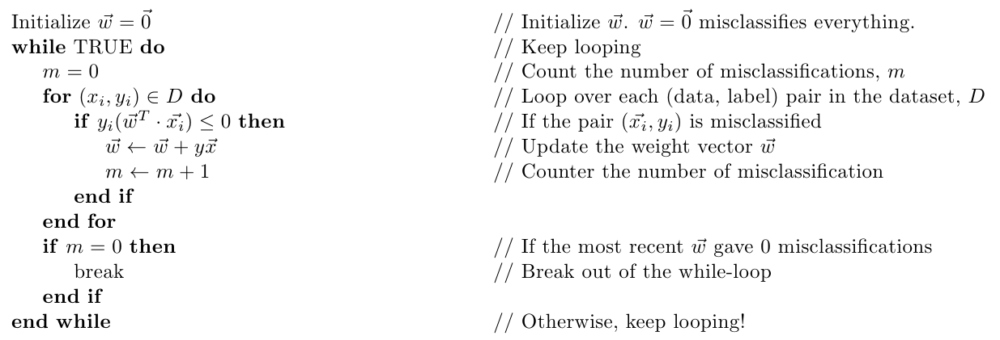

# Perceptron Algorithm

## Basic Understanding
The hyperplane separates the two classes. The hyperplane is found by finding its weights. 
$$h(x_i) = sign({w^⊤}{x_i} + b) \rightarrow eq(1) $$  
Based on which side of hyperplane the point lies, its class is decided. 
The pseudo code of the algorithm is given below.

Here, we include bias in the weight vector itself by adding an extra dimension of constant 1 in the input. 

The update $w = w + yx$ moves the w vector(hyperplane) in direction of $x$. Proof : 
After updating the $w$, $(w + yx_i)^T{x_i} = w^Tx + y{x^T}x$. Let this equation be eq(2). Here two cases : 

1.  In case of false positive : $y = 0$, $eq(1) > 0$, we need to decrease its value so that it becomes less than $0$. By updating the weight vector, it reduces the eq(1) by $x^T.x$ amount. 
1.  Quite opposite is the case with false negative. 

## Assumptions

1.  Binary classification (i.e. $y_i \in \{-1,+1\}$)
1.  Data is linearly separable

## Perceptron Convergence
If the data is linearly separable, then the algo will converge definitely, otherwise the algo will loop infinetly and will never converge. [Proof](https://www.youtube.com/watch?v=vAOI9kTDVoo&list=PLEAYkSg4uSQ1r-2XrJ_GBzzS6I-f8yfRU&index=16)