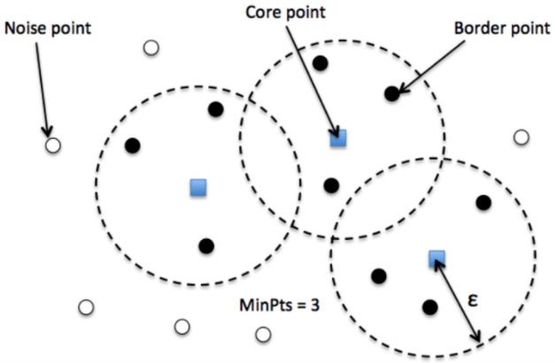

# DBSCAN clustering

[Video to watch](https://www.youtube.com/watch?v=C3r7tGRe2eI&t=714s)

## Introduction

1.  This type of clustering technique connects data points that satisfy particular density criteria (minimum number of objects within a radius).
1.  The DBSCAN algorithm views clusters as areas of high density separated by areas of low density. Due to this rather generic view, clusters found by DBSCAN can be any shape, as opposed to k-means which assumes that clusters are convex shaped. 
1.  There are three types of points: core, border, and noise. See below figure.

Core is a point that has some $(m)$ points within a particular $(n)$ distance from itself. The border is a point that has at least one core point at distance $n$. Noise is a point that is neither border nor core.

## Parameters

1.  $minPts$: for a region to be considered dense, the minimum number of points required is $minPts$.
1.  $eps$: to locate data points in the neighborhood of any points, eps($\epsilon$) is used as a distance measure.

## Algorithm
Better to watch the above video than reading the text.
## Implementation

1.  The DBSCAN algorithm is deterministic, always generating the same clusters when given the same data in the same order. However, the results can differ when data is provided in a different order. 

1.  First, even though the core samples will always be assigned to the same clusters, the labels of those clusters will depend on the order in which those samples are encountered in the data. 

1.  Second and more importantly, the clusters to which non-core samples are assigned can differ depending on the data order. This would happen when a non-core sample has a distance lower than $eps$ to two core samples in different clusters. By the triangular inequality, those two core samples must be more distant than eps from each other, or they would be in the same cluster. The non-core sample is assigned to whichever cluster is generated first in a pass through the data, and so the results will depend on the data ordering.

## Limitations

It expects some kind of density drop to detect cluster borders. DBSCAN connects areas of high example density. The algorithm is better than K-Means when it comes to oddly shaped data.

## Advantages

1.  It doesn’t require a predefined number of clusters. 
1.  It also identifies noise and outliers. Furthermore, arbitrarily sized and shaped clusters are found pretty well by the algorithm.
