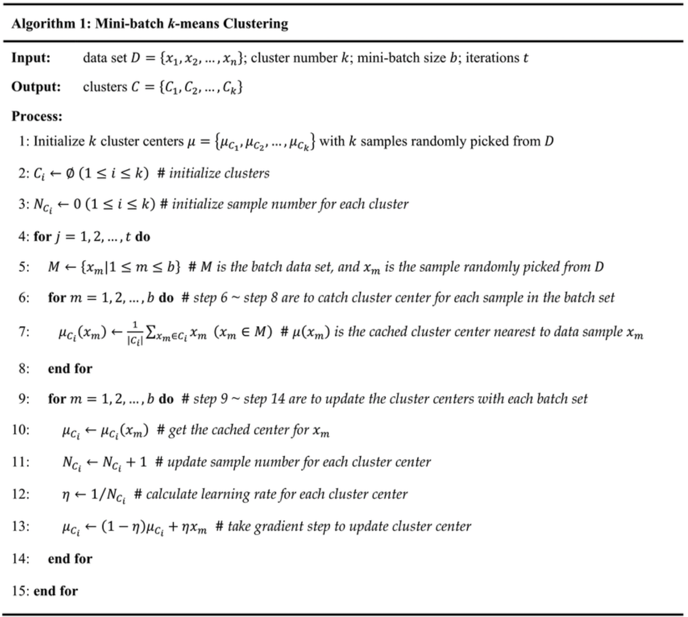

# K-Means Clustering Algorithm
[Source](https://sites.google.com/site/dataclusteringalgorithms/k-means-clustering-algorithm)

## Introduction

1.  Group similar data points together and discover underlying patterns.
1.  The K-means algorithm identifies $k$ number of centroids, and then allocates every data point to the nearest cluster, while keeping the centroids as small as possible.

## Cluster

1.  A cluster refers to a collection of data points aggregated together because of certain similarities.

## How it works

1.  To process the learning data, the K-means algorithm in data mining starts with a first group of randomly selected centroids, which are used as the beginning points for every cluster, and then performs iterative (repetitive) calculations to optimize the positions of the centroids.

1.  It halts creating and optimizing clusters when either:
    
    1.  The centroids have stabilized — there is no significant change in their values because the clustering has been successful.
    1.  The defined number of iterations has been achieved.
    
## Algorithm

Let  $X = {x1,x2,x3,……..,xn}$ be the set of data points and $V = {v1,v2,…….,vc}$ be the set of centers.

1.  Randomly select $C$ cluster centers.
1.  Calculate the distance between each data point and cluster centers.
1.  Assign the data point to the cluster center whose distance from the cluster center is minimum of all the cluster centers.
1.  Recalculate the new cluster center using: 
           $$\mu_i = \sum_{j=1}^{C_i} x_j$$
where, ‘$C_i$’ represents the number of data points in $i_{th}$ cluster.
1.  Recalculate the distance between each data point and new obtained cluster centers.
1.  If no data point was reassigned then stop, otherwise repeat from step 3). 

## Objective

1.  To minimize 
$$J = \sum_{i=1}^k \sum_{j=1}^{c_i} {||x_j - \mu_i ||}^2$$
1.  The number of optimal clusters are decided based on the above objective function (Elbow method) or any other metrics. 
1.  Elbow Method : When Loss vs $K$ graph is plotted, Usually it looks like an elbow where sudden huge decrease in the loss happens. That point is considered to be elbow and $K$ at the point is considered to be optimal. 
1.  As $K$ increases, loss always decreases. Therefore, we consider elbow point where there is a huge fall in the loss. 

1.  Difficult to find this point most of the times. If failed, then try to find the optimal point by measuring other metrics such as Silhouette score, DB Index etc, at each value of K.

## Limitations

1.  K-Means clustering is good at capturing the structure of the data if the clusters have a spherical-like shape. It always tries to construct a nice spherical shape around the centroid. This means that the minute the clusters have different geometric shapes, K-Means does a poor job clustering the data.

1.  This algorithm highly depends on the initialization. Therefore, in practice, we run the Kmeans algorithm several times with different initialization and consider that initialization with lower clustering loss. 

## Points to remember

1. Since K-Means use a distance-based measure to find the similarity between data points, it’s good to standardize the data to have a standard deviation of one and a mean of zero.
1. The elbow method used to select the number of clusters doesn’t work well as the error function decreases for all $K$'s.
1. If there’s overlap between clusters, K-Means doesn’t have an intrinsic measure for uncertainty for the examples belonging to the overlapping region to determine which cluster to assign each data point.
1. K-Means clusters data even if it can’t be clustered, such as data that comes from uniform distributions.

# Mini-Batch K-Means

1. An efficient version of K-Means. 
1. To reduce the complexity of K-Means, Mini batch K-Means is proposed. 
1. Pseudo code of the algorithm can be found below. It is similar to SGD. 

